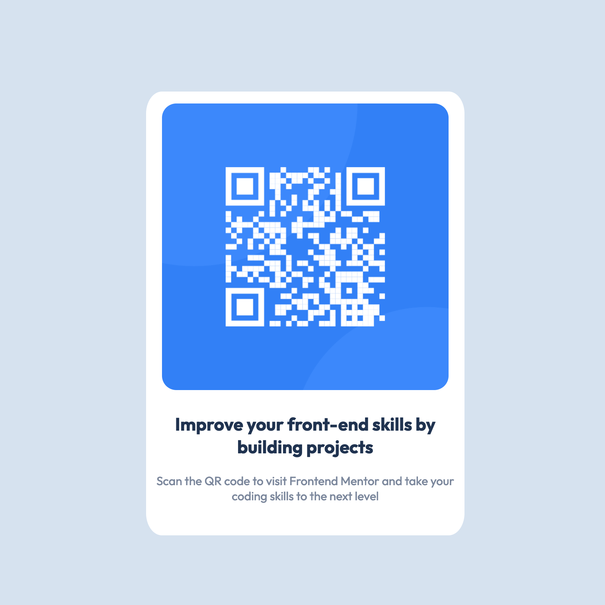

# Frontend Mentor - QR code component solution

This is a solution to the [QR code component challenge on Frontend Mentor](https://www.frontendmentor.io/challenges/qr-code-component-iux_sIO_H). Frontend Mentor challenges help you improve your coding skills by building realistic projects. 

## Table of contents

- [Overview](#overview)
  - [Screenshot](#screenshot)
  - [Links](#links)
- [My process](#my-process)
  - [Built with](#built-with)
  - [Continued development](#continued-development)
  - [Useful resources](#useful-resources)
- [Author](#author)

## Overview

### Screenshot

### Links

- Solution URL: [https://github.com/97Afolabi/frontend-mentor/tree/main/qr-code-component](https://github.com/97Afolabi/frontend-mentor/tree/main/qr-code-component)
- Live Site URL: [https://97afolabi.github.io/frontend-mentor/qr-code-component](https://97afolabi.github.io/frontend-mentor/qr-code-component)

## My process

### Built with

- Semantic HTML5 markup
- CSS custom properties
- Flexbox

### Continued development

I will practise designing layouts with CSS flexbox and grid going forward

### Useful resources

- [Basic concepts of flexbox on MDN](https://developer.mozilla.org/en-US/docs/Web/CSS/CSS_flexible_box_layout/Basic_concepts_of_flexbox) - This helped me understand the basic concept of using CSS flexbox

## Author

- Website - [I am learning](https://iamlearn.i.ng)
- Frontend Mentor - [@97Afolabi](https://www.frontendmentor.io/profile/97Afolabi)
- Twitter - [@97Afolabi](https://www.twitter.com/97Afolabi)
